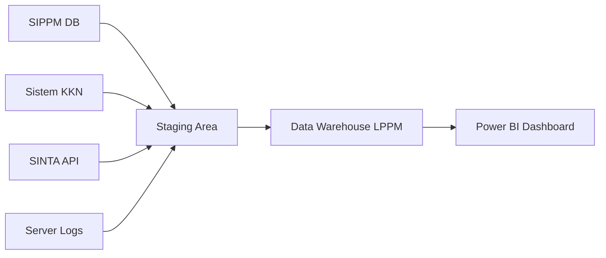

# Data Source Identification
## Data Warehouse LPPM ITERA

---

## 1. Available Data Sources

Sistem Data Warehouse LPPM mengintegrasikan data dari berbagai sumber operasional kampus:

| Data Source | Type | Volume | Update Frequency | Quality | 
|------------|------|--------|------------------|---------|
| **SIPPM (Sistem Penelitian)** | OLTP Database | ~50K rows | Real-time | High |
| **Sistem KKN** | Web Database | ~5K rows/sem | Semesteran | High |
| **SINTA / Scopus** | External API | ~10K rows | Bulanan | Medium |
| **Log Server** | Server Logs | ~100K rows | Real-time | High |
| **Data Kepegawaian (SIM-SDM)** | Database | ~500 users | Daily | High |
| **Repositori Dokumen** | File System | ~2K files | Weekly | Medium |

---

## 2. Data Profiling

### SIPPM (Data Proposal)
Dataset Name: Data Pengajuan Proposal Total Records: ~50,000 (Historis 2022-2025) Attributes: id_proposal, judul, id_ketua, id_skema, dana_diajukan, dana_disetujui, tgl_pengajuan, status Data Types: INT, VARCHAR, DECIMAL, DATETIME Null Values: < 1% (pada field opsional) Primary Key: id_proposal Foreign Keys: id_ketua (→ Dim_Peneliti), id_skema (→ Dim_Skema)

**Data Quality Assessment**:
- Completeness: 99% (Data wajib lengkap saat submit)
- Accuracy: 100% (Validasi sistem)
- Consistency: Tinggi (Referential integrity terjaga)

### Sistem KKN
Dataset Name: Data Penempatan KKN Total Records: ~5,000/tahun Attributes: id_kkn, nim_mahasiswa, id_dpl, lokasi_desa, periode Data Types: INT, VARCHAR, DATE Primary Key: id_kkn

**Data Quality Assessment**:
- Completeness: 100% (Mahasiswa wajib pilih lokasi)
- Accuracy: 98% (Manual input lokasi kadang typo)

### Log Server (System Analytics)
Dataset Name: Log Akses & Pencarian Total Records: ~100,000 baris Attributes: log_id, timestamp, keyword, user_action, dataset_id, response_time Data Types: INT, DATETIME, VARCHAR

**Data Quality Assessment**:
- Completeness: 100% (System generated)
- Volume: Tinggi (Perlu partisi)

---

**Data Quality Assessment**:
- Completeness: 100% (System generated)
- Volume: Tinggi (Perlu partisi)

---

## 3. Data Source Mapping (ETL Flow)

Extract:

SIPPM: Full extract untuk data master, Incremental untuk data transaksi harian.

Log Server: Stream processing atau batch tiap malam.

SINTA: Scheduled API call setiap akhir bulan.

Transform:

Standardisasi Nama: Membersihkan gelar dosen (Prof., Dr.) agar seragam.

Konversi Tanggal: Mengubah format timestamp menjadi DateKey (YYYYMMDD).

Kalkulasi: Menghitung Lama_Review_Hari (Tgl Keputusan - Tgl Ajuan).

Data Masking: Menyensor NIDN/NIM untuk user publik.

Load:

Fact Table: Insert data transaksi baru.

Dimension Table: Update data master (SCD Type 2 untuk perubahan jabatan dosen).

4. Integration Architecture
Batch Integration (Utama)
Schedule: Harian jam 02:00 WIB (Traffic rendah).

Tool: SQL Server Stored Procedure (usp_Master_ETL) dipanggil oleh SQL Agent Job.

Failover: Retry otomatis 3x jika gagal.

Security & Governance
Access Control: Hanya User 'Analyst' yang boleh akses data mentah di Staging.

Audit Trail: Mencatat setiap perubahan pada tabel Fact_Proposal (Insert/Update/Delete).

Backup: Full Backup mingguan, Diff harian, Log per 6 jam.
